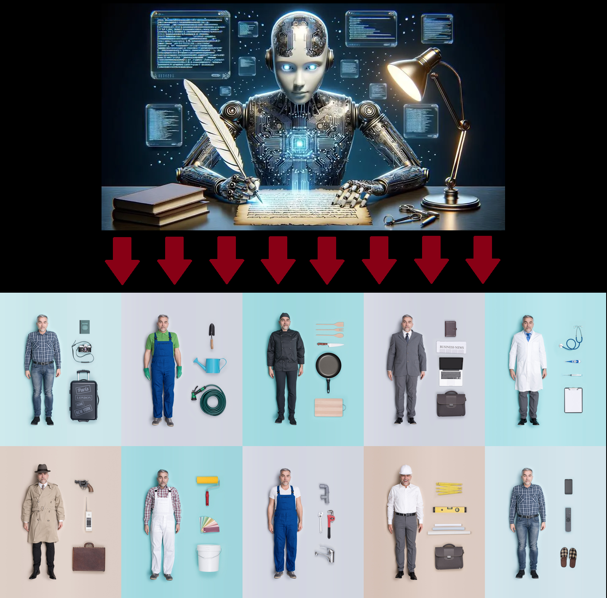

# WEB INTELLIGENCE - CLASSIFICATION CHALLENGE  
### Organized by the European Statistics Awards Programme


---

## 👥 Team Composition

- **Dimitrios Petridis** – Data Scientist, European Central Bank*  
  📧 dimitrios.petridis@ecb.europa.eu  
- **Georgios Kanellos** – Team Lead Statistics, European Central Bank*  
  📧 georgios.kanellos@ecb.europa.eu  
- **Jannic Cutura** – Senior Data Engineer, European Central Bank* & Research Fellow, DSTI  
  📧 jannic.cutura@dsti.institute  

---

## 🏆 Placement Awards

- 🥇 **1st Place - Reusability Award (10.000€)**
- 🥇 **1st Place - Innovativity Award (5.000€)**
- 🥉 **3rd Place - Accuracy Award (3.000€)**

---

## 🎯 Challenge Summary

The [**Web Intelligence - Classification of Occupations for Online Job Advertisements Challenge**](https://statistics-awards.eu/competitions/12), organized by the **European Statistics Awards Programme** and managed by [Eurostat](https://ec.europa.eu/eurostat), tasked participants with building automated systems for classifying multilingual online job advertisements (OJAs) into occupation codes defined by the **International Standard Classification of Occupations (ISCO)** taxonomy.

### Objective

The main goal was to develop **robust, scalable, and innovative approaches** that:
- Process large volumes of semi-structured and multilingual **job advertisement** text
- Assign the most appropriate **four-digit ISCO occupation code**
- Handle **cross-linguality**
- Demonstrate **reproducibility, reusability, and innovation**

### Dataset Overview

Participants were provided with a **multilingual dataset** containing:

- `job_posting_id` – unique identifier  
- `job_title` – job posting headline/title  
- `job_description` – main textual content of the ad  

All entries were anonymized and sampled from a **pan-European corpus** of ~26,000 job ads scraped from ~400 websites. The dataset is representative of labor demand across the European Union.

A separate **gold-standard evaluation set** (not shared with participants) was used for scoring.

### Classification Target: ISCO

The target taxonomy is the **ISCO (International Standard Classification of Occupations)**, developed by the International Labour Organization (ILO). It has a **4-level hierarchical structure**, where:

- Major Groups (1-digit)
- Sub-Major Groups (2-digit)
- Minor Groups (3-digit)
- Unit Groups (4-digit)

Each job ad must be mapped to one of the ~400 4-digit ISCO unit groups.

---

## 🔬 Our Methodology

Our solution is built around a **Retrieval-Augmented Generation (RAG)** architecture enhanced by **weighted multilingual embeddings** and **Generative AI reasoning**, designed to scale across languages, occupations, and job markets.



### Hardware

We executed the pipeline on an **virtual machine** equipped with:
- 2× NVIDIA A100 GPUs (80GB each)
- 48 vCPUs
- 440 GB RAM

This hardware allowed us to run multi-GPU inference and experiment iteratively with memory-efficient model configurations.

Our [classification pipeline](main.ipynb) operating on this hardware takes place in the four conceptual stages.

### 1. Pre-processing of Input Data

We implemented a robust, modular text-cleaning pipeline to ensure the consistency and quality of both job titles and descriptions. Key features include:

- Normalization of whitespace, casing, and punctuation
- HTML decoding and tag stripping
- Token-level adjustments
- Handling of missing or noisy fields
- Unicode compatibility across multilingual inputs

This cleaning process enhances the quality of downstream embeddings and improves retrieval accuracy.

### 2. Multilingual Semantic Embedding & Retrieval

We represented both job advertisements and ISCO taxonomy entries in a **shared multilingual vector space** using the **`BAAI/bge-m3`** model from the **FlagEmbedding** library. This transformer is trained for **zero-shot, cross-lingual retrieval**, making it ideal for multilingual labor market data.

#### Job Advertisement Embeddings

For each job advertisement, we independently embed:  
- `title_clean`  
- `description_clean`

Each of these fields is passed through the **BGE-M3 encoder**. To capture the relative importance of description over title, we combine them using a **weighted linear combination**:

**x = w_title · E_title + w_desc · E_desc**

Where:  
- **E_title**, **E_desc** ∈ ℝᵈ are embeddings of the job title and description  
- **w_title = 0.3**, **w_desc = 0.7** (empirically chosen after experimentation)

This results in a single vector **x** ∈ ℝᵈ representing the full job ad.

#### ISCO Taxonomy Embeddings

We apply the same embedding process to **multiple ISCO taxonomy fields** across **levels 1 to 4**, including:

- `title_ext_*_clean`
- `description_ext_*_clean`
- `tasks_include_*_clean`
- `included_occupations_*_clean`

We exclude “excluded occupations” and “notes” from the final combination (but embeddings are precomputed and available). For each level **l**, we compute:

**y_l = w_title · E_title + w_desc · E_desc + w_tasks · E_tasks + w_inc · E_included**

Where:
- **E_title**, **E_desc**, **E_tasks**, **E_included** ∈ ℝᵈ are embeddings of respective fields
- **w_title = 0.3**, **w_desc = 0.7**, **w_tasks = 0.5**, **w_inc = 0.6** (empirically chosen after experimentation)

This produces **level-specific vectors** for each ISCO group.

To form the final taxonomy vector **yᵢ**, we combine level vectors using:

**yᵢ = w₁ · y₁ + w₂ · y₂ + w₃ · y₃ + w₄ · y₄**

With level weights:
- **w₁ = 0.2**, **w₂ = 0.4**, **w₃ = 0.5**, **w₄ = 0.7** (empirically chosen after experimentation)

This reflects the increasing specificity and relevance of deeper ISCO levels.

#### Similarity Computation

Let:
- **x** ∈ ℝᵈ: final job embedding  
- **yᵢ** ∈ ℝᵈ: final ISCO vector for class *i*

We compute pairwise **cosine similarity**:

**sim(x, yᵢ) = (x · yᵢ) / (‖x‖ × ‖yᵢ‖)**

This yields a **similarity matrix** `S ∈ ℝ^{N×M}` for **N jobs** and **M ISCO classes**.

#### k-NN Candidate Retrieval

From the similarity matrix, we retrieve the **top-k most similar ISCO groups** for each job:

**TopK(x) = argmax_{i ∈ 1…M} sim(x, yᵢ), for k = 5**

This step ensures semantic relevance of labels and prompt size efficiency for the downstream LLM step.

These top-k candidates form the **retrieval stage** of our **Retrieval-Augmented Generation (RAG)** pipeline and are passed into the Generative AI module for final classification.

This embedding and retrieval layer is **core to our system’s interpretability, scalability, and multilingual performance**, allowing us to reduce the classification space while preserving high semantic alignment between job texts and ISCO codes.

### 3. Retrieval-Augmented Generation (RAG) with Generative AI

After identifying the top-k most semantically similar ISCO labels for each job advertisement, we classify each job using a **Generative AI model** via structured prompting.

This is the **generation** step of our Retrieval-Augmented Generation (RAG) pipeline. We use a pre-trained **Meta-Llama-3.1-8B-Instruct** model to infer the most likely ISCO code based on the job ad and retrieved ISCO candidates.

#### Prompt Construction

We create custom prompts that include:
- A **system instruction** specifying how to classify the job using context
- A **user message** with the job title and job description
- A **context block** listing the top-k ISCO candidates (from the embedding similarity step)

Below are the prompt templates, which we generate per job advertisment:

**System prompt:**
```
You will receive a job title and a job description (which may be in any language).
Your task is to classify the job advertisement into the appropriate four-digit code from the given CONTEXT.
Use the following CONTEXT to determine the correct classification:

[ISCO CANDIDATE CONTEXT]

Your output must be only the four-digit classification ID, and no additional text or explanations.
Available classes are: [CLASS LIST]
```

**User prompt:**

```
Below is a job advertisement.
Your task is to classify it using one of the provided four-digit classification IDs.
Provide only the correct four-digit ID in response.

JOB TITLE: [TITLE]
JOB DESCRIPTION: [DESCRIPTION]
```

#### LLM Inference

We use Hugging Face’s `transformers` library to perform inference using a modern multilingual Large Language Model:

- **Pipeline**: `"text-generation"`
- **Model**: `meta-llama/Meta-Llama-3.1-8B-Instruct`
- **Precision**: `torch.bfloat16`
- **Device**: `CUDA` (multi-GPU supported)

The model receives a fully structured prompt (see above) and generates a **single four-digit ISCO classification ID** as output.

### 4. Post-Processing & Submission

After LLM inference, we apply a lightweight yet robust post-processing step to guarantee valid outputs:

#### Output Cleaning & Validation

Each raw LLM response is then post-processed to extract a clean, valid **four-digit ISCO classification code**:

1. We use **regular expressions** to extract the **first 4-digit string** from the generated output.
2. The extracted code is **checked against the official ISCO-08 level-4 taxonomy** to ensure validity.

In cases where:
- The output is `"error"` (e.g., inference failure), or  
- The extracted code is **not part of the allowed taxonomy**,

we automatically apply a **fallback mechanism** and the prediction is replaced by the **most semantically similar ISCO label** retrieved during the embedding phase (**knn = 1**).

#### Final Submission Formatting

The final model predictions are compiled into a `.csv` file with the following structure:

- Two columns: `id`, `code`
- No header row, as required by the official competition format

This file represents the complete classification output for all job advertisements and is ready for submission.

---

### 🙏 Acknowledgements

We gratefully acknowledge the following contributions and technologies that enabled this project:

- **Eurostat** and the **Jožef Stefan Institute** for organizing the Web Intelligence Classification Challenge and providing a meaningful, real-world dataset
- The **open-source community**, whose tools and libraries made our work possible, including:
  - **FlagEmbedding** for multilingual vector representations
  - **Hugging Face Transformers** and **PyTorch** for seamless integration of state-of-the-art LLMs
  - **Pandas**, **TQDM**, and other ecosystem tools for efficient data handling and experimentation
 
 ---

The views expressed on this page are those of the authors and do not represent the view of the ECB or the ESCB.
 
